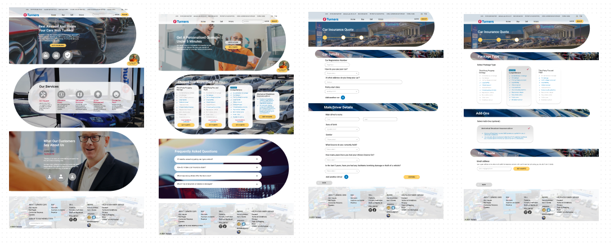

# Mission 5

Group: Andy,  Ewan,  Lindsay, Muryum, Nicholas




## How to run this app:


Create an empty floder in your PC, inside of your folder run:

```
git init
git clone https://github.com/GSirB9108/MRL5M5-front.git
npm i
npm start

```

## Dependencies of the app:

This project uses the following dependencies:

- Node.js

  - Node.js needs to be installed on the developer's computer to run this application.
  - After install we can use NPM inside of terminal under Node.js environment.
  - if you get package.json file from this App,please run these commands:
    - npm i
    - npm start

- React

  - react-router-dom
  - react-icons

- Material-UI

  - Using stripe create & save product API.
  - Using stripe complete checkout process.

- Clould Service:
 
  - Azure
  - [Deply link](https://nice-desert-07a2ae510.azurestaticapps.net/)

- CI/CD Tools
  - Github Action

## Mission Describtion
### For UX Designer :
1.	Create a profile page/website with the objective to showcase your design work (past and future items in your Missions or other designs you have done) and attract potential employers.  Do not forget to think about your target personas and their experience. 

### For Developer:
1.	Create the motor vehicle insurance application from your group’s UX Designer based on the prototype and/or user stories.  Pick a few interesting screens to work on - you do not have to completely create the entire application.  From time to time you may need to clarify designs with UX Designers who designed the application.  You can use any programming language you like. 
2.	Automate the deployment of your application to the cloud, like how you did for Mission 4.  As soon as you “git push” a new version of the code to your GitHub project, it should trigger the new code to be automatically deployed to a cloud.
3.	Create/update your account on GitHub and you showcase your projects on the GitHub account. All projects you did in the Missions throughout this programme (or possibly your past coding work) should be put into your GitHub repository.  You should also make sure your account is “presentable”. E.g. have a profile picture and a profile README, write descriptions on the overview pages of your projects on GitHub that describes the usage, etc.  
